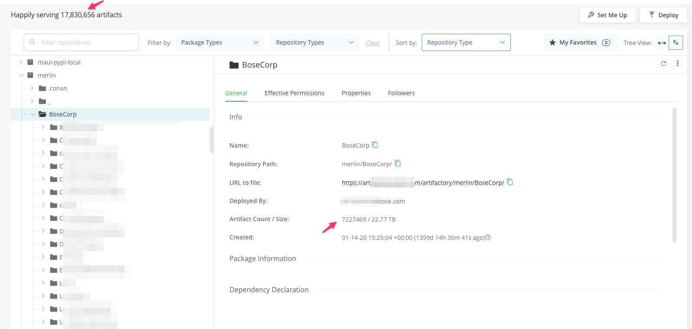

# Artifactory Migration Script

When migrating a repo using the [jf rt transfer-files](https://jfrog.com/help/r/jfrog-cli/step-5-push-the-files-from-the-source-to-the-target-instance) tool or via push replication , it may fail 
as  explained in [Why Large Repository Push Replications Can Fail](https://jfrog.com/help/r/why-large-repository-push-replications-can-fail/why-large-repository-push-replications-can-fail)

For example , the replication status shows:
```
jf rt curl -k -n -XGET "/api/replication/merlin" --server-id usvartifactory5

Output:
{
  "status" : "error",
  "lastCompleted" : "2023-10-04T15:37:45.102Z",
  "targets" : [ {
    "url" : "https://xyz.jfrog.io/artifactory/merlin/",
    "repoKey" : "merlin",
    "status" : "error",
    "lastCompleted" : "2023-10-04T15:37:45.102Z"
  } ],
  "repositories" : {
    "merlin" : {
      "status" : "error",
      "lastCompleted" : "2023-10-04T15:37:45.102Z"
    }
  }
}
```
So the script in [transfer.sh](https://git.jfrog.info/projects/PROFS/repos/ps_jfrog_scripts/browse/transfer-artifacts/transfer.sh) also will not work.

This is because  7+ million artifacts  out of 17+ million in the Artifactory are  under one folder.
 .  

This Bash script is designed to migrate artifacts from one Artifactory instance to another. It supports migrating files and subfolders recursively while providing the option to transfer only the root folder.
It also PATCHES the properties for the migrated artifacts.

## Usage

```bash
./migrate_n_subfolders_in_parallel.sh <source-artifactory> <source-repo> <target-artifactory> <target-repo> <transfer yes/no> [root-folder] [migrateFolderRecursively yes/no] [semicolon-separated exclude_folders]
```

- source-artifactory: The source Artifactory instance.
- source-repo: The source repository in the source Artifactory instance.
- target-artifactory: The target Artifactory instance.
- target-repo: The target repository in the target Artifactory instance.
- transfer yes/no: Specify 'yes' to transfer files or 'no' to perform other operations without transferring.
- root-folder (optional): The root folder to start the migration from (default is the current directory).
- migrateFolderRecursively yes/no (optional): Specify 'yes' to migrate subfolders recursively or 'no' to only migrate the root folder.
- semicolon-separated exclude_folders (optional): List of folders to exclude from migration, separated by semicolons.

## Prerequisites

The script requires the following tools on a linux/unix box ( it does not work on mac OS yet)  and assumes the jf is configured to connect to both   source and target Artifactory instances :
```
jf ( which you can install using "sudo yum install jf")
comm ( which you can install using "sudo yum install coreutils")
tr
sed
```

## Execution
The script creates an "output" folder and runs the migration inside it. It processes files and subfolders in parallel to optimize performance.

- It lists files in the source and target repositories using AQL queries.
- Compares the file lists and identifies files to transfer.
- Transfers files and their properties from the source to the target repository.
- The script logs :
    - all the successful  uploads to output/successful_commands.txt
    - If there are failures it logs to  output/failed_commands.txt ( note: you may not see the failed_commands.txt if there are not upload failures).
- When the script completes , in the output/successful_commands.txt you should see:
```
All transfers for $source_repo completed
```
For example for the merlin repo you will see:
```
All transfers for merlin completed
```
## Configuration
- parallel_count: Controls the maximum number of parallel execution threads.
- failed_commands_file: Records failed commands .
- successful_commands_file: Records successful commands.
- all_commands_file: Logs all commands executed.

## Functions
- execute_artifact_migration: Executes migration commands for a single artifact.
- run_migrate_command: Runs the migration commands for a folder and its subfolders.
- run_migration_for_folder: Manages the migration process for a folder and its subfolders.
- migrateFolderRecursively: Recursively migrates subfolders.
- processLeafFolderContents: Migrates files in leaf folders and subfolders.

## Example:
```
./migrate_n_subfolders_in_parallel.sh ncr ndce-releases ncratleostest ndce-releases yes
```


You can also give a specific folder or file path , for example:
```
./migrate_n_subfolders_in_parallel.sh ncr ndce-releases ncratleostest ndce-releases yes com/ncr/ndce/tools/ndce-host
```
or
```
./migrate_n_subfolders_in_parallel.sh ncr ndce-releases ncratleostest ndce-releases yes com/ncr/ndce/tools/ndce-host/ndce-host-.pom
```

To migrate only the root folder run as:
```
./migrate_n_subfolders_in_parallel.sh ncr ndce-releases ncratleostest ndce-releases yes com/ncr/ndce/tools/ndce-host yes
```
To exclude certain folders from transferring to target artifactory you can pass as 
[semicolon-separated exclude_folders] as:
```
./migrate_n_subfolders_in_parallel.sh ncr ndce-releases ncratleostest ndce-releases yes . yes "folder1;folder2"
```

You can run it using screen utility using:
```
screen -dmS upload-session9 bash -c '/app/sureshv/migrate_n_subfolders_in_parallel.sh usvartifactory5 merlin jfrogio merlin  yes   2>&1 | tee upload-session9.log; exec bash'
```


For this customer using this script I was able to transfer 500GB of artifacts per day.

Then by using the  [generate_screen_commands_for_subfolders/generate_screen_commands_for_subfolders.py](../generate_screen_commands_for_subfolders/generate_screen_commands_for_subfolders.py) script as explained in
[generate_screen_commands_for_subfolders](../generate_screen_commands_for_subfolders) which generates a bash script to  run this migrate_n_subfolders_in_parallel.sh script for 18 subfolders in parallel   , I was able to transfer almost 2 TB ( approximately 1.5 million artifacts) per day.